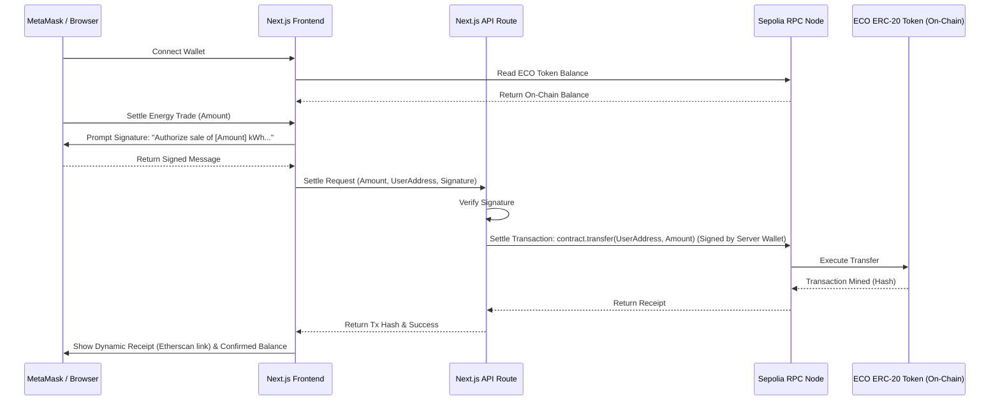

# Design Document - Real Blockchain & MetaMask Integration

This document outlines the architecture, components, and data flow for replacing the mock energy trading simulation with a live, on-chain ERC-20 token ecosystem on the Ethereum Sepolia Testnet.

## Overview
We are integrating a real MetaMask connection. Users can connect their Web3 wallet, view their actual balance of `ECO` tokens, and execute real-time peer-to-peer energy settlements. The backend server acts as a relayer (gas fee sponsor) to mint or transfer standard ERC-20 `ECO` tokens directly to the user's wallet.

## Components & Architecture

### 1. Smart Contract (`EcoToken`)
- Standard ERC-20 contract containing token details:
  - Name: **Eco Sync Token**
  - Symbol: **ECO**
  - Decimals: **18**
- Fully compatible with MetaMask for custom token imports.
- Standard Solidity source code will be deployed to Sepolia, and the ABI/bytecode will be bundled locally for interactions.

### 2. Next.js Backend & RPC Provider
- Public RPC endpoints will be used to query on-chain variables (balance, name, decimals).
- Environment Variables in `.env.local`:
  - `NEXT_PUBLIC_ECO_TOKEN_ADDRESS`: Address of the deployed ECO token contract.
  - `NEXT_PUBLIC_SEPOLIA_RPC_URL`: Sepolia testnet RPC gateway.
  - `BLOCKCHAIN_PRIVATE_KEY`: Server relayer private key, funded with testnet Sepolia ETH, which pays gas for token transfers.

### 3. Frontend Web3 Integration
- **Wallet Connection**: Using `ethers.BrowserProvider` to check MetaMask.
- **Network Verification**: Checks if connected chain ID matches Sepolia (`11155111`). If mismatch, prompt switch using MetaMask's `wallet_switchEthereumChain` RPC request.
- **Gasless User Verification**: The user signs a secure human-readable message using MetaMask's `personal_sign` or `signMessage`, which the server verifies.
- **On-Chain Settle UI States**:
  1. Connected
  2. Awaiting Signature
  3. Broadcasting Transaction
  4. Pending block confirmation (showing dynamic Etherscan link)
  5. Succeeded/Failed

## Error Handling & Edge Cases
- **MetaMask Not Installed**: Prompt link to MetaMask installation site.
- **Insufficient Server Gas**: Return clean API error `"Server gas reserve depleted. Please contact grid operator."`
- **Network Congestion**: Set reasonable timeout for confirmations and display Etherscan link so users can track transaction progress in real-time.
