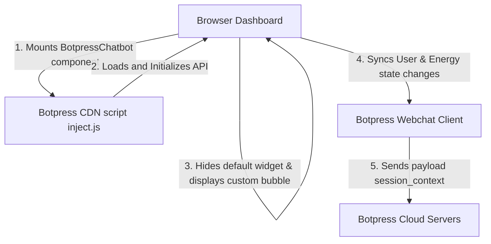

# Design Document: Botpress Chatbot Integration with Context-Sync

## 1. Overview
The Botpress Chatbot integration establishes a dynamic "Aetheria Grid Assistant" that helps users learn about smart home automation, grid simulation metrics, and peer-to-peer ERC-20 token trading. Instead of a generic floating widget, this system hides the default Botpress launcher and uses a custom-styled, glassmorphic floating button styled to match the dark-slate, emerald, and amber theme of Eco-Sync Nexus. 

Additionally, the integration synchronizes user context in real-time. Whenever the user is authenticated, their profile information and current grid metrics (solar generation, battery levels, wallet balance) are pushed to the chatbot session. This enables personalized greetings and intelligent context-aware support.

---

## 2. Technical Architecture & Data Flow



### Script Execution and Control
1. **Dynamic Injector**: The component dynamically loads `https://cdn.botpress.cloud/webchat/v1/inject.js`.
2. **Initialization Config**: The client initializes the bot using `window.botpressWebChat.init()` with custom theme colors, linking it to the Bot ID and Client ID config variables.
3. **Widget State Controls**:
   * Hide default launcher bubble: `showWidget: false`, `hideWidget: true`.
   * Programmatic show: `window.botpressWebChat.sendEvent({ type: "show" })`.
   * Programmatic hide: `window.botpressWebChat.sendEvent({ type: "hide" })`.

### Dynamic State Sync Pipeline
On page load, and whenever local storage or context states mutate (solar yield, battery levels, wallet balance), we push the updated parameters using `window.botpressWebChat.sendPayload`:
* `name`: User's profile name (default "Nexus Explorer").
* `email`: User's profile email.
* `batteryLevel`: Live battery capacity (kWh).
* `batteryPct`: Battery level percentage.
* `solarGeneration`: Active solar yield (kW).
* `gridDependency`: Load drawing from the utility grid (kW).
* `walletBalance`: Current ECO tokens in MetaMask.

---

## 3. Database & System Configuration
No database schema changes are required for this integration since the chatbot reads transient states directly from the active client session context.

We will add the configuration credentials to the environment parameters file:
### `.env.local`
```bash
# Botpress Webchat Credentials
NEXT_PUBLIC_BOTPRESS_BOT_ID="[user_bot_id_placeholder]"
NEXT_PUBLIC_BOTPRESS_CLIENT_ID="[user_client_id_placeholder]"
```

---

## 4. UI Specification
* **Floating Launcher**:
  * Style: Glassmorphism (`backdrop-blur-xl bg-zinc-900/60 border border-emerald-500/20 shadow-[0_0_30px_rgba(16,185,129,0.15)]`).
  * Icon: Glowing custom `Bot` or `MessageSquare` icons.
  * Motion: Micro-interactive hover effects (scale up by `1.1`) and spring-loaded click behavior.
  * Notifications: Optional glowing badge if there is a system tip or alert.
* **Responsive Layout**:
  * Position: Fixed at bottom-right (`right-6 bottom-6`).
  * Z-index: High overlay z-index (`z-[150]`) to sit above charts but below critical system modals.
  * Safe Zone: Adjusts when settings drawers or screens collapse to avoid blocking main dashboard elements.

---

## 5. Verification Plan
1. **Script Validation**: Ensure the third-party JavaScript injector loads correctly without throwing console syntax errors or blocking the Main Thread.
2. **Custom Launcher Verification**: Click the custom floating launcher to confirm that it correctly opens and closes the chatbot panel.
3. **Theme & CSS Checks**: Confirm the chatbot layout is containerized properly, does not overflow off-screen on mobile viewports, and uses the emerald styling configurations.
4. **Context Send Validation**: Add debug logs to verify that `sendPayload` calls fire correctly when solar generation settings are changed or battery charges change.
