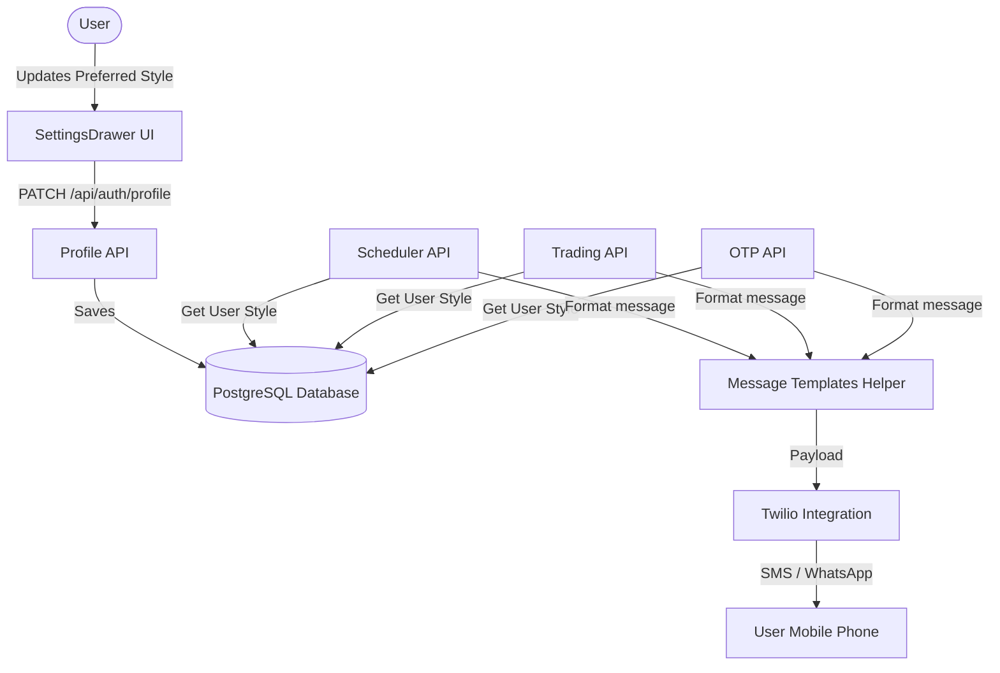

# Cyberpunk Message Customizer Design Doc

**Goal:** Implement a customizable cyberpunk-themed notification system. Users will be able to select their preferred message format preset (Nexus Border, Quantum Terminal, Neo-Minimalist, Grid Override, or Dynamic Random) via a new interactive phone preview emulator in the settings.

## System Architecture



## Proposed Changes

### 1. Database Schema
* **File**: `prisma/schema.prisma`
* Add `messageStyle` to `User` model:
  ```prisma
  messageStyle String @default("random")
  ```

### 2. Message Templates Library
* **File**: `src/lib/message-templates.ts`
* We will centralize the existing message styling options.
* Key templates:
  * **OTP Code Verification**: Format single-use OTP codes.
  * **Timer Scheduled (Armed)**: Format appliance start timers.
  * **Device Activated (Running)**: Format live appliance updates.
  * **Trade Confirmed**: Format energy trades and ECO payout.
* Preset styles mapping:
  * `nexus-border` -> ASCII single-line box drawing border.
  * `quantum-terminal` -> ASCII double-line/block headers.
  * `neo-minimalist` -> Plain lines / monospace slashes.
  * `grid-override` -> Heavy industrial warning layout with indicators.
  * `random` -> Pick a style dynamically.

### 3. Profile API Route
* **File**: `src/app/api/auth/profile/route.ts`
* Include `messageStyle` in list of allowed updates in the `PATCH` handler.

### 4. Interactive Phone Emulator Customizer UI
* **File**: `src/components/SettingsDrawer.tsx`
* Create a phone mockup view in the Settings Drawer.
* Tabs: `OTP`, `Timer`, `Trade`.
* Style selector with hover glow and animations.
* Live monospace display rendering the selected message layout.
* Triggers updates instantly on selection change.

### 5. Backend Integrations
* Update endpoints to read `user.messageStyle` and call `getFormattedMessage(...)`:
  * `src/app/api/auth/otp/send/route.ts`
  * `src/app/api/trading/sell/route.ts`
  * `src/app/api/forecaster/schedule/route.ts`
  * `src/app/api/auth/test-notify/route.ts`
