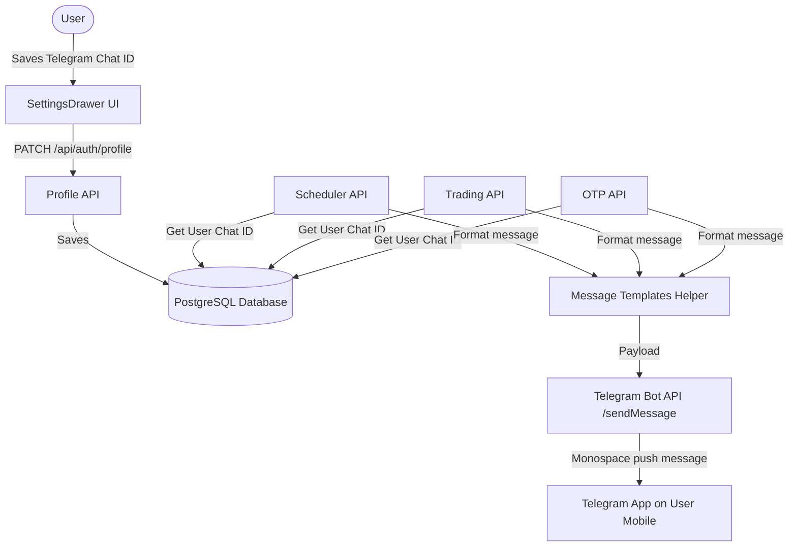

# Telegram Bot Notifications Design Doc

**Goal:** Replace Twilio SMS/WhatsApp integration with a 100% free Telegram Bot notification gateway. Users will save their Telegram Chat ID in settings and receive instant, monospace-rendered cyberpunk alerts on their Telegram mobile/desktop app.

## Architecture



## Proposed Changes

### 1. Database Schema
* **File**: `prisma/schema.prisma`
* Add `telegramChatId` to `User` model:
  ```prisma
  telegramChatId String? @default("")
  ```

### 2. Telegram Helper Library
* **File**: [NEW] `src/lib/telegram.ts`
* Implements `sendTelegramMessage(chatId: string, text: string)`.
* Wraps messages in `<pre>...</pre>` tags with `parse_mode: "HTML"` to preserve ASCII monospace styling.

### 3. Profile Updates & Context
* **Files**: `src/app/api/auth/profile/route.ts` and `src/context/AuthContext.tsx`
* Update allowed PATCH params list and UI types to include `telegramChatId`.

### 4. Settings Drawer Customizer
* **File**: `src/components/SettingsDrawer.tsx`
* Replace "Mobile Phone Number" field with "Telegram Chat ID" text field.
* Embed instructions for obtaining Chat ID and starting the bot.
* Update Alert Channels cards to read "Telegram Uplink" instead of Twilio channels.

### 5. Backend Refactoring
* Replaced `sendTwilioMessage` with `sendTelegramMessage` in:
  * `src/app/api/auth/otp/send/route.ts`
  * `src/app/api/trading/sell/route.ts`
  * `src/app/api/forecaster/schedule/route.ts`
  * `src/app/api/auth/test-notify/route.ts`
